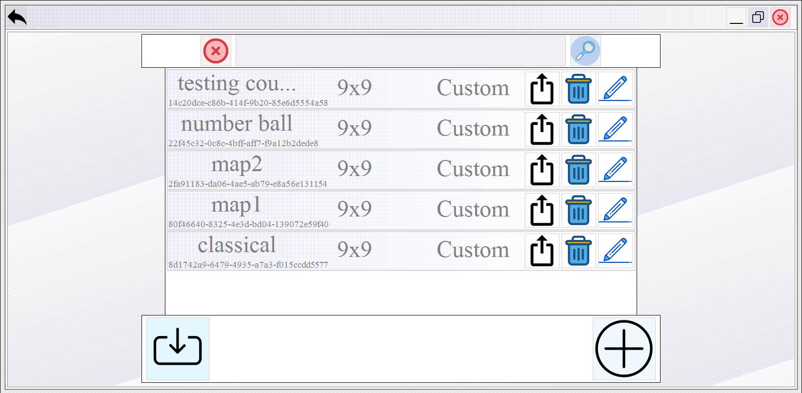
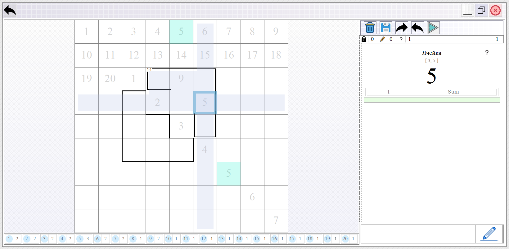

# Sudoku
Идея проекта — создать универсальную платформу для различных видов Sudoku, с возможностью комбинирования правил и создания уникальных уровней. Главная цель — объединить классические и нестандартные вариации в одном редакторе.

## Что реализовано
- [x] Рабочий редактор поля
- [x] Графическая отрисовка сетки, цифр и спец. символов
- [x] Сохранение / загрузка карт
- [x] Базовая структура логики правил
- [x] Интерфейс игрока

## Особенности реализации
- Самописные UI-контролы для рисования и проигрывания поля
- Большой объём логики
- Много работы с графикой Windows Forms (ручная отрисовка)

## Статус проекта
Проект заброшен. Интерфейс — черновой, использовались временные иконки, самописные контролы писались "на издыхании" и требуют переработки. Тем не менее, в проект вложено много усилий, особенно в части графики и редактирования полей. Игровой режим отсутствует — доступен только редактор, хотя контрол для проигрывания полей сделан.

## Скриншоты

